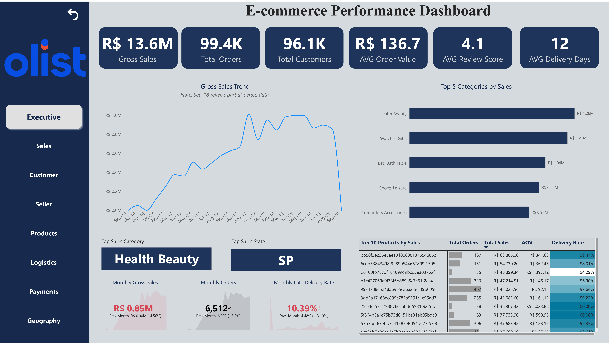
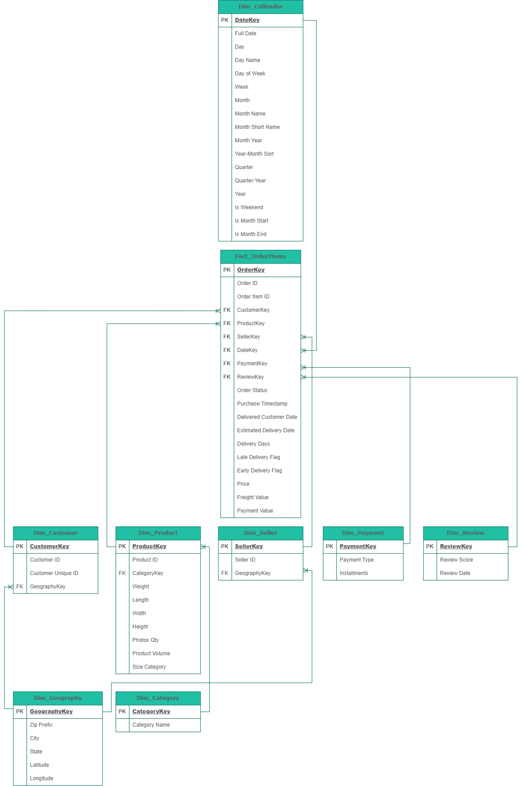
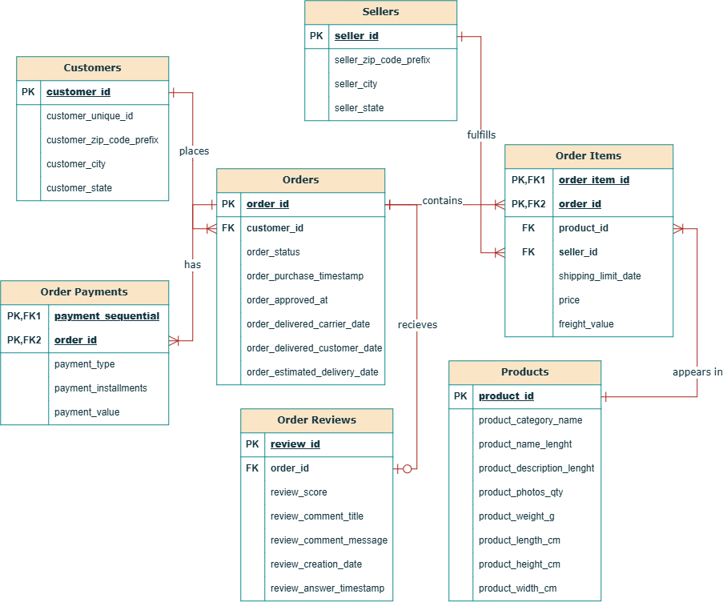

# Olist E-Commerce Performance Dashboard

An end-to-end Business Intelligence project — from business requirements to data modeling to an interactive Power BI dashboard to business insights — built on the [Olist Brazilian E-Commerce dataset](https://www.kaggle.com/datasets/olistbr/brazilian-ecommerce).



---

## 1. Project Overview

This project simulates a complete enterprise BI delivery cycle for a Brazilian e-commerce marketplace (Olist), covering four perspectives end-to-end:

- **Business Analysis** — requirements gathering, documentation, and traceability
- **Data Analysis** — SQL-based data profiling, cleaning, and dimensional modeling
- **BI Development** — Power BI semantic modeling, DAX, and dashboard design
- **Business Insights** — translating the finished dashboard into findings and recommendations

Rather than jumping straight to a dashboard, the project follows the discipline a real BI team would use: understand the business problem first, design the data architecture deliberately, build and validate the pipeline, then extract decision-ready insights from the result.

## 2. Business Objective

> Analyze Olist's e-commerce performance across sales, customers, sellers, products, logistics, payments, and geography to identify performance trends, operational risks, and opportunities for improvement.

## 3. Project Approach

The project was run solo across four role perspectives, each handing off formal deliverables to the next:

```text
Business Analyst  →  Data Analyst  →  BI Developer  →  Business/Insights Analyst
```

| Role | What was done |
|---|---|
| **Business Analyst** | Gathered and documented requirements (BRD, Requirement Analysis Document), defined scope and a Requirement Traceability Matrix, tracked work in Jira/Confluence |
| **Data Analyst** | Designed the Software Design Document (SDD) and ERD, profiled and cleaned the raw data in MySQL, built the dimensional model |
| **BI Developer** | Built the Power BI semantic model, authored ~90 DAX measures, designed the 8-page dashboard |
| **Business/Insights Analyst** | Interpreted the finished dashboard, identified key findings, and produced business recommendations |

## 4. Project Lifecycle

```text
Business Requirements → Requirement Analysis → System & Data Design →
SQL Data Preparation → Data Profiling & Cleaning → Dimensional Modeling →
Power Query Validation → Power BI Modeling & DAX → Dashboard Development →
Insights & Recommendations
```

## 5. Tools & Technologies

| Area | Tools |
|---|---|
| Business Analysis | BRD, Requirement Analysis Document, Meeting Minutes |
| System / Data Design | SDD, ERD, Schema Design (Lucidchart, Draw.io) |
| Database | MySQL |
| Data Preparation | SQL, Power Query |
| BI & Visualization | Power BI |
| Analytics | DAX |
| Version Control | Git / GitHub |
| Documentation | Microsoft Word / PDF |

## 6. Dataset

The [Olist Brazilian E-Commerce Public Dataset](https://www.kaggle.com/datasets/olistbr/brazilian-ecommerce) contains real, anonymized order data from ~100K orders placed on the Olist marketplace between 2016 and 2018, including:

- Orders, Order Items, Order Payments, Order Reviews
- Customers, Sellers
- Products, Product Category Name Translation
- Geolocation

## 7. Data Architecture / Model

The SQL layer prepares the raw data into staging tables, which are profiled, cleaned, and transformed into a dimensional model — a **Hybrid Fact Constellation (Galaxy) Schema** with 4 fact tables and 6 dimensions — which is then loaded and further validated in Power BI.



The operational (source-system) ERD — reflecting the normalized structure of the raw Olist tables before transformation — is also included for reference:



## 8. SQL Workflow

```text
Database Setup → Staging Tables → Data Profiling → Data Cleaning →
Dimension & Fact Transformation
```

Each stage was scripted and validated independently — row counts, NULL audits, duplicate checks, referential integrity checks, and business-rule anomaly checks were run before any cleaning, and cleaning was only applied where a fix could be justified. See [`03_SQL/`](03_SQL/) for the full scripts.

## 9. Power BI Dashboard

The dashboard has 8 pages, each targeting a specific business area:

| Page | Focus |
|---|---|
| Executive | Overall business performance |
| Sales | Sales performance and trends |
| Customer | Customer behavior and retention |
| Seller | Seller performance and risk |
| Products | Product and category performance |
| Logistics | Delivery and fulfillment |
| Payments | Payment behavior |
| Geography | Regional performance |

The dashboard uses What-If parameters, Field Parameters for dynamic metric switching, and ~90 DAX measures spanning time intelligence, ranking, and risk scoring.

- 📊 **Interactive file:** [`04_Power_BI/E-Commerce Performance Dashboard.pbix`](04_Power_BI/E-Commerce%20Performance%20Dashboard.pbix) — open in Power BI Desktop to explore
- 📄 **Full report:** [`04_Power_BI/E-Commerce_Performance_Dashboard.pdf`](04_Power_BI/E-Commerce_Performance_Dashboard.pdf)
- 🧩 **Power BI Project:** The PBIP, Report, and Semantic Model project files are also included for reference and version control.

## 10. Key Insights

A preview of the most important findings — the full analysis is in the linked report.

- **Low repeat purchasing:** 96.88% of customers are observed as single-order customers within the dataset window.
- **Recent logistics deterioration:** late-delivery rate rose from 4.48% to 10.39% in the latest monthly comparison.
- **Revenue-per-order pressure:** orders grew 3.5% month-over-month while gross sales fell 4.56% — more orders, less revenue per order.
- **Seller risk varies widely:** some sellers show late-delivery rates above 20% even with high order volume.
- **Freight is material:** freight cost is R$2.3M, 16.6% of gross sales.

→ [View the complete Insights & Solutions report](05_Insights_and_Solutions/)

## 11. Business Recommendations

Recommendations were developed directly from the dashboard findings above, covering:

1. **Customer Lifecycle & Repeat-Purchase Strategy**
2. **Seller Risk Management**
3. **Logistics Optimization**
4. **AOV Improvement**
5. **Freight Efficiency**
6. **Geographic Expansion**

Each is framed as a decision-support direction with defined KPIs, not a guaranteed outcome — the recommended approach is **Identify → Diagnose → Prioritize → Act → Monitor**.

→ [View the full recommendations](05_Insights_and_Solutions/)

## 12. Repository Structure

```text
01_Business_Analysis/       BRD, Meeting Minutes, Requirement Analysis Document
02_System_Design/           Software Design Document (SDD), ERDs, Schema Design
03_SQL/                     Database setup, staging, profiling, cleaning, transformation scripts
04_Power_BI/                Power BI (.pbix), PBIP project, semantic model, report and dashboard PDF
05_Insights_and_Solutions/  Business Insights & Recommendations report
readme_assets/              README dashboard and ERD images
```

## 13. Project Deliverables

- ✅ Business Requirements Document
- ✅ Meeting Minutes
- ✅ Requirement Analysis Document
- ✅ Software Design Document
- ✅ ERDs (Operational + Dimensional)
- ✅ Schema Design (Hybrid Fact Constellation)
- ✅ SQL Scripts (Setup → Staging → Profiling → Cleaning → Transformation)
- ✅ Power BI Dashboard (`.pbix`)
- ✅ Power BI Project (`.pbip`)
- ✅ Power BI Report & Semantic Model
- ✅ Dashboard Report (PDF)
- ✅ Insights & Solutions Report

## 14. Limitations

- The dataset represents a fixed historical observation window (September 2016 – August 2018); recent-period trends in the analysis should be read as signals, not confirmed long-term patterns.
- Some source data contained missing or inconsistent values (e.g., invalid dates, mismatched payment/order totals). Anomalies were retained where no reliable correction was possible, and this is documented in the data cleaning scripts.
- Customer retention figures are affected by the fixed dataset window — customers who purchased near the end of the observation period had less time to make a second purchase.

## 15. How to Explore This Project

- **For business context**, start with [`01_Business_Analysis/`](01_Business_Analysis/)
- **For technical implementation**, see [`03_SQL/`](03_SQL/) and [`02_System_Design/`](02_System_Design/)
- **For the final dashboard**, see [`04_Power_BI/`](04_Power_BI/)
- **For conclusions and recommendations**, see [`05_Insights_and_Solutions/`](05_Insights_and_Solutions/)

## 16. Author

**Dhruv Kashyap**

[GitHub](https://github.com/DHRUV-K-bit) · kashyapdhruv227@gmail.com
